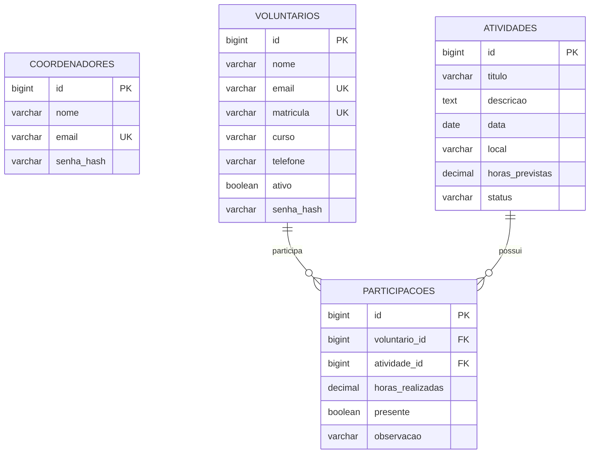

# Extensão em Ação — Gerenciamento de Voluntários

Sistema web desenvolvido em **Java com orientação a objetos**, arquitetura **MVC**, banco de dados relacional e interface responsiva. O projeto permite controlar voluntários, atividades, participações e carga horária de um projeto de extensão universitário.

## Tecnologias

- Java 17
- Spring Boot 3
- Spring MVC
- Thymeleaf
- Spring Data JPA
- Banco H2 persistido em arquivo
- Bean Validation
- HTML e CSS próprios
- Maven

## Funcionalidades

### Coordenador

- Login com sessão e senha protegida por PBKDF2.
- Dashboard com indicadores do projeto.
- CRUD completo de voluntários.
- CRUD completo de atividades.
- Registro, edição e exclusão de participações.
- Controle de presença e horas realizadas.
- Validação para impedir participação duplicada.
- Relatório de carga horária por voluntário.
- Indicação automática de aptidão para certificado.

### Voluntário

- Login individual.
- Visualização das atividades em que participou.
- Consulta da carga horária total.
- Acompanhamento do progresso para certificação.

## Arquitetura MVC

```text
src/main/java/br/edu/extensao/voluntarios
├── config          # inicialização do banco e configuração web
├── controller      # recebe requisições e escolhe as views
├── dto             # formulários e objetos de transferência
├── exception       # exceções de regra de negócio
├── interceptor     # autenticação e autorização por perfil
├── model           # entidades de domínio/JPA
├── repository      # acesso ao banco de dados
├── service         # regras de negócio
└── util            # utilitários, como hash de senha

src/main/resources
├── static/css      # estilo da aplicação
├── templates       # views Thymeleaf
└── application.properties
```

Fluxo principal:

```text
View → Controller → Service → Repository → Banco de Dados
```

## Modelo do banco



A tabela `participacoes` representa um relacionamento N:N entre voluntários e atividades e possui atributos próprios, como horas realizadas, presença e observação.

## Como executar

### Pré-requisitos

1. Java JDK 17 ou superior.
2. Maven 3.9 ou superior.

No Windows, confirme no PowerShell:

```powershell
java -version
mvn -version
```

Execute na pasta do projeto:

```powershell
mvn spring-boot:run
```

Acesse:

```text
http://localhost:8080
```

O banco é criado automaticamente na pasta `data`. Para reiniciar os dados iniciais, feche o sistema e apague essa pasta.

## Usuários iniciais

### Coordenador

- E-mail: `admin@extensao.com`
- Senha: `admin123`

### Voluntários

A senha inicial de todos é `voluntario123`.

- `tiago@extensao.com`
- `pamela@extensao.com`
- `josiane@extensao.com`

## Critérios atendidos

- **Implementação:** autenticação, dashboards, CRUDs, relacionamento N:N, validações, relatórios e cálculo de horas.
- **Banco de Dados:** persistência relacional H2/JPA, chaves estrangeiras, restrições de unicidade e dados iniciais.
- **Boas práticas/MVC:** separação por camadas, DTOs, serviços, repositórios, controllers, views, tratamento de exceções e nomes claros.
